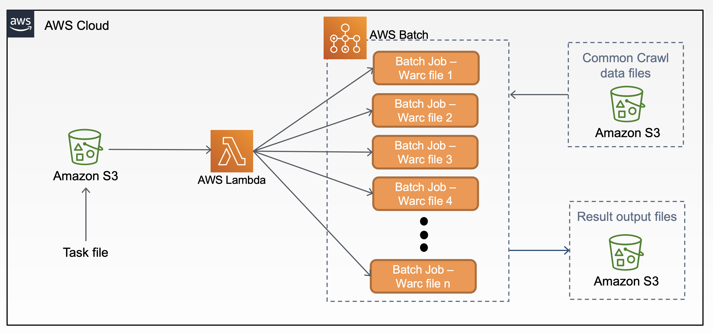

# warc-analytics-wac2021
This project is to build a serverless data analytics application that processes the Common Crawl files stored in the AWS S3. This application is composed of AWS Lambda, AWS Batch, Container, and ArchiveSpark. This AWS solution can be deployed using a [CloudFormation stack](README.md#deploy-warc-analytics-wac2021-using-cloudformation-stack) or [AWS CLI](README.md#deploy-warc-analytics-wac2021-using-aws-cli-for-advanced-users). 

The source code is specific for this research work and you are free to update it for your work. See [Customization](README.md#customization) for details. 

As always, you are more than welcome to contribute and make this solution better and/or support more use cases.

## Presentation slides
* [WAC 2021 - Analyzing WARC on Serverless Computing](docs/iipc21_v2.pdf)

## Workflow

1. A task file is uploaded to the S3 bucket
2. S3 bucket triggers a lambda function
3. Lambda function reads the content in the task file and submits multiple batch jobs
4. Each batch job downloads a [Common Crawl](https://commoncrawl.org/the-data/) WARC file, processes it, creates devirative content, and uploads the result output files to the target S3 bucket

### Deploy warc-analytics-wac2021 using CloudFormation stack
#### Step 1: Launch CloudFormation stack
[](https://console.aws.amazon.com/cloudformation/home?region=us-east-1#/stacks/new?&templateURL=https://iipc-warc-code.s3.amazonaws.com/awsbatchwarc.template)

Click *Next* to continue

#### Step 2: Specify stack details

* <b>Stack name</b>: Stack name can include letters (A-Z and a-z), numbers (0-9), and dashes (-).

* <b>Parameters</b>: Parameters are defined in your template and allow you to input custom values when you create or update a stack.

| Name | Description |
|----------|-------------|
| BatchRepositoryName | any valid name for the Batch process repository |
| DockerImage | any valid name for the Docker image. e.g. yinlinchen/vtl:iiifs3_v3 |
| JDName | any valid name for the Job definition |
| JQName | any valid name for the Job queue |
| LambdaFunctionName | any valid name for the Lambda function |
| LambdaRoleName | any valid name for the Lambda role  |
| S3BucketName | any valid name for the S3 bucket |

#### Step 3: Configure stack options
Leave it as is and click **Next**

#### Step 4: Review
Make sure all checkboxes under Capabilities section are **CHECKED**

Click *Create stack*

#### Step 5: Finish
After Cloudformation stack is deployed successfully, you will see a service is deployed in the AWS Batch. You can see a list of resources in the Cloudformation output.

### Deploy warc-analytics-wac2021 using AWS CLI (For advanced users)
Run the following in your shell to deploy the application to AWS:
* New deployment
	```
	aws cloudformation create-stack --stack-name STACKNAME --template-body file://awsbatchwarc.template --capabilities CAPABILITY_NAMED_IAM
	```
* Update the deployment
	```
	aws cloudformation update-stack --stack-name STACKNAME --template-body file://awsbatchwarc.template --capabilities CAPABILITY_NAMED_IAM
	```
* After Cloudformation stack is deployed successfully, you will see a service is deployed in the AWS Batch. You can see a list of resources in the Cloudformation output.

See [Cloudformation: create stack](https://docs.aws.amazon.com/cli/latest/reference/cloudformation/create-stack.html) for `--parameters` option.

### Cleanup

To delete the deployed application that you created, use the AWS CLI. Assuming you used your project name for the stack name, you can run the following:

```bash
aws cloudformation delete-stack --stack-name warc-analytics-wac2021
```

## Usage
* Prepare a [task.json](examples/task.json) file.
* Upload this [task.json](examples/task.json) file to the S3 bucket. You can see this S3 bucket information from the Cloudformation output. 
* The out results file will be uploaded to the S3 bucket. Note: you need to update the Docker image file and update the S3 bucket information. See [here](docker/executeNotebook.sh#L16).

### Task File
* Example task file: [task.json](examples/task.json)

| Name | Description |
|----------|-------------|
| jobQueue | Batch job queue name |
| jobDefinition | Batch job definition name |
| region | AWS region, e.g. us-east-1 |
| WARC_FILENAME | CC-MAIN-20200524210325-20200525000325-00041 |
| WARC_URL | 1590347385193.5/warc/ |

Note: You can get `WARC_FILENAME` and `WARC_URL` from the Common Crawl [warc.paths](examples/data/warc.paths) file. E.g. crawl-data/CC-MAIN-2020-24/segments/`1590347385193.5/warc/CC-MAIN-20200524210325-20200525000325-00041`.warc.gz

## Customization 

### Lambda function
* [index.py](src/index.py): Submit a batch job when a task file is upload to a S3 bucket

	Note: After you update the `index.py` file, compress this file into a `app.zip` file for cloudformation packaging.

### Create and update the Cloudformation template
```
aws cloudformation package --template-file template/template.yaml --s3-bucket iipc-warc-code --output-template-file awsbatchwarc.template
```

### Deploy the application
* New deployment
	```
	aws cloudformation create-stack --stack-name warctest --template-body file://awsbatchwarc.template --capabilities CAPABILITY_NAMED_IAM
	```
* Update the deployment
	```
	aws cloudformation update-stack --stack-name warctest --template-body file://awsbatchwarc.template --capabilities CAPABILITY_NAMED_IAM
	```

### Batch Configuration
* Compute Environment: Type: `SPOT`, MinvCpus: `0`, MaxvCpus: `256`, InstanceTypes: `optimal`
* Job Definition: Type: `container`, Image: `DockerImage`, Vcpus: `4`, Memory: `4096`
* Job Queue: Priority: `10`

### Docker image
Current Docker image is built for this research. You can update the [source code](docker/) to fit your need. This image is published at Docker Hub: [yinlinchen/vtl:iipc_v3](yinlinchen/vtl:iipc_v3). 

Note: The output result S3 bucket need to be changed to your S3 bucket that you have permission to write. It is located in [here](docker/executeNotebook.sh#L16).

### Create a custom ECS AMI
The default storage size is about 8GB, the ECS optimized AMI is 30GB. Also, download docker images take time, so create a custom image with docker image is already pulled. Steps to create a custom AMI list below.

1. Create an instance using [Amazon ECS-optimized AMIs](https://docs.aws.amazon.com/AmazonECS/latest/developerguide/ecs-optimized_AMI.html). It is region specific, so pick the correct AMI ID in your region.
	| Region | AMI ID |
	|----------|-------------|
	| us-east-1 | ami-09a3cad575b7eabaa |
	| us-west-1 | ami-0ec4aded37931c8b5 |
	| us-west-2 | ami-0b58521c622a24969 |

2. Pull an image from a registry
	```
	docker pull yinlinchen/vtl:iipc_v3
	```

3. Creating a compute resource AMI
	* You must stop it and remove any persistent data checkpoint files before creating your AMI.
	```
	sudo systemctl stop ecs
	sudo rm -rf /var/lib/ecs/data/*
	```
	* Create a new AMI from your running instance.
	[Learn more](https://docs.aws.amazon.com/batch/latest/userguide/create-batch-ami.html).

4. Note your custom AMI ID
	* Use that information to update the cloudformation template [here](template/template.yaml#L187).
